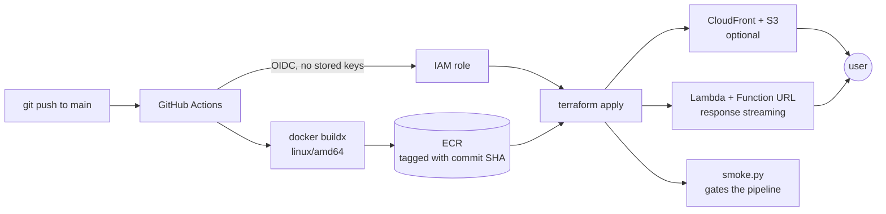

# Slipway

[](https://github.com/bunyamin-polat/slipway/actions/workflows/ci.yml)
[](https://github.com/bunyamin-polat/slipway/actions/workflows/deploy-dev.yml)
[](LICENSE)

**A deployment blueprint that puts a containerised FastAPI app on AWS — with response
streaming, infrastructure as code, and a pipeline that redeploys on merge.**

```bash
git clone https://github.com/bunyamin-polat/slipway.git && cd slipway
uv sync
uv run python scripts/deploy.py dev     # → a live URL
uv run python scripts/destroy.py dev    # → nothing left
```

Measured, not claimed: **42 seconds** from that command to a working URL, **22 seconds**
to remove every trace, **1 minute 22 seconds** from a merge on `main` to the new version
being live.

---

## Why this exists

Most AI portfolios stop at a screenshot of localhost. The code is fine, the model calls
work, and nothing has ever been deployed — because deployment is a separate skill and
learning it once, properly, is a week nobody budgets for.

This is that week, done once, in a form that every later project can copy. It contains
**no AI at all**. That is the point: the payload is deliberately forty lines of FastAPI so
the deployment is the interesting part.

The gap it closes is specific. CI is easy and common; CD is neither. A repository with a
green test badge says "my code compiles". A repository with a live URL, a Terraform state,
a cost breakdown and a one-command teardown says something else.

## How it works



The application inside the container is an ordinary HTTP server. The
[AWS Lambda Web Adapter](https://github.com/awslabs/aws-lambda-web-adapter) baked into the
image translates Lambda invocations into HTTP requests, so there is no Lambda-specific
code anywhere in the app — and the identical image runs on App Runner, or locally under
`docker run`, unchanged.

## The one file you edit

`slipway.yaml` is the whole configuration. It generates Terraform's variables, so a value
exists in exactly one place — there are no `*.tfvars` to copy and keep in sync.

```yaml
name: my-app
region: us-east-1

image:
  repository: my-app
  dockerfile: docker/Dockerfile.fastapi
  context: app

compute:
  target: lambda # or apprunner
  memory: 1024
  timeout: 30

environments:
  dev:
    cdn: false
    observability: true
    log_retention_days: 7
  prod:
    cdn: true
    log_retention_days: 30
    alert_emails: ["you@example.com"]
```

Your application has to provide exactly two things: an HTTP server on `$PORT`, and a
`/healthz` that returns 200. That is the entire contract.

## What is in the box

| Terraform module | What it gives you |
| --- | --- |
| `budget` | Account budget with email alerts. Applied **before** anything billable. |
| `lambda_container` | Container on Lambda, Function URL, response streaming, log group with retention, IAM scoped to that one log group |
| `apprunner_service` | The always-warm alternative, same image, autoscaling capped |
| `static_site` | Private S3 + CloudFront + OAC, one hostname for page and API, streaming-safe cache behaviour |
| `observability` | Three alarms and a dashboard, including cold starts charted from the logs |

| Script | What it does |
| --- | --- |
| `deploy.py` | build → push → apply → sync static → invalidate → print the URL |
| `destroy.py` | tear down, then **ask AWS** whether it really went |
| `smoke.py` | health, page, and streaming — measured by arrival time, not status code |
| `run_local.py` | the same image, locally, under the same environment contract |

Stacks are numbered by the order they are applied: `00_bootstrap` once per account
(budget, state bucket, ECR, the GitHub OIDC role), `20_app` once per environment as a
Terraform workspace.

## The pipeline

| Workflow | Trigger | What it does |
| --- | --- | --- |
| `ci.yml` | every push and PR | ruff, pytest, tflint, image build — **no AWS credentials at all** |
| `plan.yml` | pull request | posts `terraform plan` as a comment, updating it in place |
| `deploy-dev.yml` | merge to `main` | deploys, then gates on the smoke test |
| `promote.yml` | manual | promotes an **existing image tag** to prod behind an approval gate |

`promote.yml` never rebuilds. The artifact tested in dev is the artifact that reaches
prod, which is the reason images are tagged with a commit SHA — and why a rollback is
`deploy.py prod --tag <older-sha>` rather than an archaeology project.

There is no `AWS_SECRET_ACCESS_KEY` anywhere. GitHub Actions assumes a role over OIDC,
pinned to this repository and to three triggers: the default branch, pull requests, and
named environments.

## Measured

All numbers from `us-east-1`, observed from Türkiye, on the example app.

| | |
| --- | --- |
| Merge on `main` → live | **1 m 22 s** |
| `deploy.py dev` locally | 42 s (build + push + apply) |
| `destroy.py dev` | 22 s — about 15 minutes when CloudFront is enabled |
| Lambda cold start | **2.2 – 3.5 s** (1024 MB, 80.8 MB compressed image) |
| Lambda warm | 356 ms observed, of which **2 ms** is Lambda; the rest is the round trip |
| App Runner first request | 634 ms — no cold start, ever |
| App Runner warm | 455 ms |

**Lambda or App Runner?** The same image runs on both; `compute.target` picks.

| | Lambda | App Runner |
| --- | --- | --- |
| Idle cost | $0 | provisioned memory, billed continuously |
| Cold start | 2.2 – 3.5 s | none |
| Billing | per invocation-millisecond, **including time spent waiting** | memory always, CPU while serving |
| Streaming setup | three settings in three places | nothing to configure |

That third row decides more than it looks. Lambda bills wall-clock, and a streaming
endpoint holds its invocation open for the entire response: a request that streamed for
1957 ms billed 1957 ms with the CPU essentially idle. An app that streams model output for
thirty seconds pays for thirty seconds of Lambda. For anything interactive and slow, App
Runner is often the cheaper answer as well as the faster one.

**A CDN is a trade, not a free win.** Putting CloudFront in front made the static page
twice as fast (498 ms → 223 ms) and made the first API call *slower* (442 ms → 4367 ms) —
because static traffic no longer keeps the function warm.

## Four things that will bite you

Every one of these was hit while building this, and the fix is in the code.

**1. `--platform linux/amd64`.** An image built on Apple Silicon dies on Lambda with
`Runtime.InvalidEntrypoint`, which mentions nothing about architecture.

**2. buildx attestations.** Docker 28 attaches provenance and SBOM metadata by default,
turning the push into a manifest index with an `unknown/unknown` entry. Lambda answers
*"The image manifest, config or layer media type … is not supported"*. Build with
`--provenance=false --sbom=false`.

**3. Streaming needs three settings aligned** — `AWS_LWA_INVOKE_MODE=response_stream` in
the image, `invoke_mode = "RESPONSE_STREAM"` on the Function URL, and `compress = false`
on the CloudFront behaviour. Miss any one and the response still arrives, still looks
correct, and is delivered in one lump at the end. This is why `smoke.py` measures *when*
events arrive rather than whether they did, and why there is a test that runs it against a
deliberately buffering server.

**4. Deleting things by hand leaves debris.** Removing a Lambda in the console leaves its
log group (retention: never expire) and its IAM role behind, with no error and no warning.
Terraform-managed environments take them along. This is the entire argument for
`destroy.py`, and for it verifying against AWS instead of trusting an exit code.

A fifth, for anyone wiring up OIDC: GitHub's subject claim now carries immutable numeric
IDs — `repo:owner@78386903/repo@1323385694:environment:dev`. Neither GitHub's error nor
AWS's mentions the subject. Read the real claim out of CloudTrail's
`AssumeRoleWithWebIdentity` events rather than guessing.

## Cost

The design keeps idle spend at zero rather than small:

- **Lambda + Function URL** — per request, nothing when idle
- **S3 state** — kilobytes, with old versions expiring after 90 days
- **ECR** — the only storage that grows; a lifecycle policy expires untagged images after
  7 days and keeps the last 10
- **Alarms and dashboard** — inside the free tier (10 alarms, 3 dashboards)
- **CloudFront** — free while idle, per request otherwise
- **App Runner** — the exception: roughly $3/month minimum, because it cannot scale to zero

A **budget alarm is the first thing applied to an account**, before any billable resource
exists, at 50 / 80 / 100 % of a monthly limit plus a forecast alert. Free-tier credits are
excluded from it deliberately, so the alarm reports what the account genuinely costs
rather than what is currently reaching your card.

## Using it in your own project

See **[docs/adopting.md](docs/adopting.md)**. Short version: copy the modules, scripts and
workflows into your repository, edit `slipway.yaml`, run `deploy.py`.

**Copy, do not reference.** Terraform can load a module straight from a git URL, and that
would make every project's `apply` depend on this repository's `main` branch — one bad
commit here breaking six deployments at once. Copying costs a manual update when a module
improves. Take that trade.

## What this does not do

Being clear about the edges is part of the point:

- **No VPC.** `10_network` is a placeholder. Most apps do not need one, and a NAT gateway
  costs about $32 a month for as long as you forget about it.
- **No custom domain or ACM certificate.** Function URLs and CloudFront domains only.
- **No secrets module yet.** The example app reads none, and an unused Secrets Manager
  entry is cost and cleanup debt in exchange for proving nothing.
- **`Dockerfile.fullstack` is untested.** The example's frontend is a single static page,
  so there is nothing for a Node build stage to do. It waits for a real frontend rather
  than a fake one.
- **Adoption is proven once, partially.** A clean clone with only `slipway.yaml` changed
  deployed a differently-named app in 43 seconds, passed its smoke test beside the
  original environment, and destroyed in 24 seconds. But it was the same repository
  layout and the same example app. A project with its own code, secrets and domain will
  find edges that test could not.

## Licence

MIT — see [LICENSE](LICENSE). It is a blueprint to copy from, not a service to depend on.
